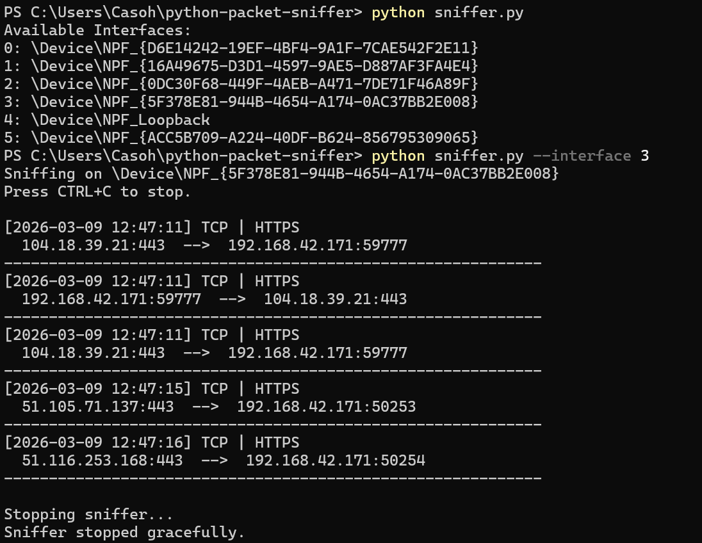

# Python Packet Sniffer – Phase 3

## Overview

This project is a Python-based network packet sniffer built using the Scapy library.  
It captures live network traffic and performs basic analysis of packets in real time.

Phase 3 extends the previous versions by introducing **traffic analytics and monitoring capabilities**, allowing the tool to summarize captured traffic statistics such as packet rates, protocol distribution, and top communicating hosts.

The goal of the project is to demonstrate practical understanding of:

- Network packet capture
- Protocol inspection
- Kernel-level packet filtering (BPF)
- Asynchronous packet processing
- Traffic monitoring and analytics

---

## Phase 3 Improvements

Phase 3 introduces real-time traffic monitoring features that transform the packet sniffer into a lightweight network analysis tool.

### Traffic Statistics

The sniffer now tracks:

- Total packets captured
- Packets per second
- Protocol distribution (TCP, UDP, Other)
- Top source IP addresses
- Top destination IP addresses

### Traffic Analytics on Shutdown

When the sniffer stops (CTRL+C), it prints a traffic summary including protocol usage and the most active network hosts.

Example:

```
===== Traffic Statistics =====

Total Packets: 387
Packets/sec: 19.7

Protocol Distribution
TCP: 240
UDP: 120
OTHER: 27

Top Source IPs
192.168.1.4 → 110
192.168.1.7 → 75

Top Destination IPs
142.250.190.78 → 95
104.18.39.21 → 60
```

### Persistent Logging

Instead of opening and closing a file for each captured packet, the program now keeps a persistent file handle during execution and writes log entries efficiently.

### Clean Shutdown Handling

The application now properly handles `CTRL+C`, ensuring:

- Packet capture stops gracefully
- File handles close correctly
- The program exits without freezing

### Reduced CPU Usage

An idle loop with controlled sleep intervals prevents the sniffer from consuming unnecessary CPU resources while running.

---

## Features

- Live packet capture using Scapy
- Asynchronous packet sniffing (`AsyncSniffer`)
- Network interface selection
- Kernel-level filtering with BPF
- Protocol filtering (TCP / UDP)
- Port-based traffic filtering
- Application protocol detection (common ports)
- Persistent logging to file
- Graceful shutdown handling
- Real-time traffic statistics
- Protocol distribution analysis
- Top source/destination IP tracking

---

## Project Structure

```
python-packet-sniffer/
│
├── sniffer.py
├── README.md
├── README_phase1.md
└── requirements.txt
```

---

## Requirements

- Python 3.10 or higher
- Scapy
- Npcap (Windows)

Install Scapy:

```bash
pip install scapy
```

Install Npcap (required for packet capture on Windows):

https://npcap.com/

When installing, enable **WinPcap API-compatible mode**.

---

## Usage

### List Available Network Interfaces

```bash
python sniffer.py
```

Example output:

```
Available Interfaces:
0: \Device\NPF_{...}
1: \Device\NPF_{...}
2: \Device\NPF_{...}
3: \Device\NPF_{...}
4: \Device\NPF_Loopback
```

---

### Start Packet Capture

```bash
python sniffer.py --interface 3
```

---

### Filter by Protocol

```bash
python sniffer.py --interface 3 --protocol tcp
```

or

```bash
python sniffer.py --interface 3 --protocol udp
```

---

### Filter by Port

```bash
python sniffer.py --interface 3 --port 443
```

---

### Combine Filters

```bash
python sniffer.py --interface 3 --protocol tcp --port 443
```

---

### Enable Logging

```bash
python sniffer.py --interface 3 --log traffic.log
```

Captured traffic will be written to **traffic.log**.

---

## Example Output

### Live Packet Capture



---

## Protocol Detection

The sniffer performs basic application protocol identification based on commonly used ports.

| Port | Protocol |
|-----|----------|
| 80 | HTTP |
| 443 | HTTPS |
| 53 | DNS |
| 21 | FTP |
| 22 | SSH |
| 25 | SMTP |
| 5228 | Google Services |

Unknown ports are labeled as **Unknown**.

---

## Current Limitations

This project currently focuses on packet capture and basic inspection. The following features are not yet implemented:

- IPv6 support
- Flow/session tracking
- Packet rate monitoring
- Deep packet inspection
- PCAP file export
- Intrusion detection capabilities

These features are planned for future phases.

---

## Development Phases

### Phase 1
Basic synchronous packet sniffer.

### Phase 2
Architecture improvements including:

- Asynchronous packet capture
- Kernel-level filtering
- CLI argument support
- Persistent logging

### Phase 3
Traffic analytics and monitoring:

- Packet rate monitoring
- Protocol distribution statistics
- Top network hosts analysis

---

## Disclaimer

This tool is intended for educational purposes and authorized network monitoring only.

Do not capture or inspect network traffic on systems or networks without proper authorization.

---

## Author

**Phillip Kasolia**  
Cybersecurity Analyst